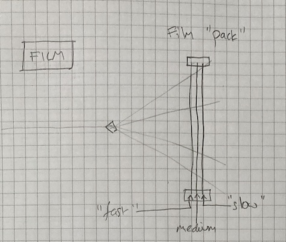
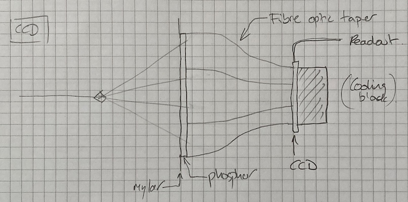
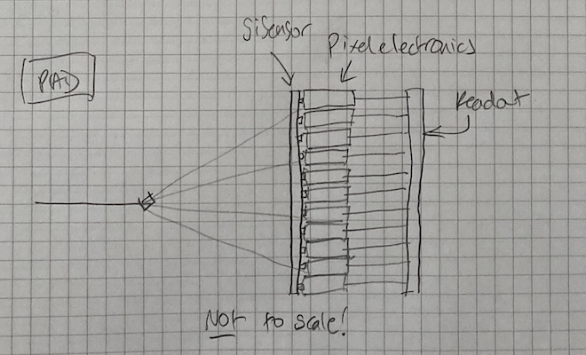

# Detectors

X-ray detectors are obviously critical for recording of diffraction. For the vast majority of structure determination area detectors are used, which record images over a given time range, during which the sample us usually rotated. The development of icreasingly fast electronic area detectors has been instrumental over the last two decades in improving the throughput of diffraction experiments. In the early days, however, film was used.

## Film

X-ray diffraction patterns may be easily recorded on photographic films (for example [Photo 51](https://en.wikipedia.org/wiki/Photo_51)). While this was an effective way of recording the data, care needed to be taken not to over-expose or under expose, and "data processing" involved chemicals and a dark room. In some cases multiple films were recorded at the same time as a "pack":

Where "fast" film (i.e. most sensitive) was at the front, with medium / slow film behind. This allowed strong and weak reflections to be recorded at the same time, but required careful handling of the films to ensure consistent orientations. As a historical comment: the `FLM` in `MOSFLM` refers to film, and the program used to be used to control an electronic film scanner and process data one scan line at a time.

After films, electronic image plates which are slow, but high resolution, and multi-wire detectors which are fast but low resolution were developed before CCD detectors became mainstream.

## CCD

CCD based detectors make use of a phosphor screen, which converts X-ray photons to a large number of visible light photons, a fibre obtic taper and a CCD sensor to record X-ray diffraction data:

These typically had read-out times around a second and a certain amount of read-out noise. More often than not detectors were made from multiple modules as a mosaic (e.g. 3x3 or 4x4 modules) with the full image being reconstructed after acquisition. The substantial read-out time and read-out noise favoured relatively small numbers of images being recorded and "1s / 1°" was a pretty typical if not always appropriate rule. The CCD itself acquires charge in individual pixels, which is then read out through an analogue to digital converter. It is possible to have more charge in a pixel than can be reliably recorded giving rise to obvious "overloads" which are typically indicated by a pixel value of 65535 (usually insigned short integers were used as the data type). As CCD detectors are integrating they can also measure "dark current" i.e. the acquisition of counts as a result of thermal effects. This is minimised by cooling the sensor, and will typically be subtracted as part of the acquisition process. To ensure no negative pixel values are recorded usually a positive "pedestal" is added which will generally ensure all pixels read out are positive.

CCD detectors slow the collection of data as they require exposure followed by a separate readout, so cannot be used in a continuous mode (unlike pixel array detectors as discussed below) however have an advantage in that they can record photons at an arbitrary rate, provided that the pixels themselves are not saturated. As such they can still be found on X-FEL beamlines.

## Photon Counting Pixel Array Detector

Photon counting pixel array detectors (Pilatus, Eiger) enabled shutterless continuous data collection. Earlier examples (Pilatus 2, Eiger) had a small but measurable read-out time. More recent iterations (Pilatus 3, Eiger 2) make use of double buffering to give almost instantaneous (~ µs) read-out times. Pixel array detectors work by direct conversion of the X-ray photon into electronic charge by ionising one of the atoms in the sensor. A substantial potential difference then "drags" the electrons towards the read out, where the charge pulse is counted. In a PAD every pixel has its own read-out electronics:

Inside the pixel electronics the charge is compared with a threshold value: if it exceeds this value then a count is recorded, and if not it is ignored. This has a benefit of eliminating dark current, but requires care when the charge from one photon is read out across multiple pixels. The typical compromise is to set the threshold value to half of the photon energy, ensuring that no more than one count can be recorded for each photon. While the capability to record continuously and capture pretty much every photon has enabled a step change in the throughput of beamlines, some care still needs to be taken in collecting data. An individual pixel requires a small amount of time to record a photon (typically ~ O(ns)) - if a second photon arrives at the same time it is possible only one will be recorded. This gives rise to a count _rate_ limit which is surprisingly easy to reach with a good crystal on a bright beamline. In addition the sensor has finite thickness, and so there is a calculable probability of a photon passing straight through without being recorded. This probably increases with photon energy, reducing the effective quantum efficiency of the detector. More recently detectors with cadmium telluride sensors have become available which are more sensitive at high energy thanks to their much higher atomic number than silicon, but at the cost of reduced sensitivity at low photon energies.

For photon counting detectors it is generally the case that recording twice as many observations with half the flux will give comparable results, in the absence of detector saturation and radiation damage. As these detectors are commonplace, it is therefore worth starting gently with data collection.

## Summary

The question of how best to collect data depends substantially on the detector being used: in most cases however photon counting pixel array detectors are used, simplifying the process of collecting data. The main considerations are to ensure that

- complete data are recorded
- radiation damage is not excessive
- the detector count rate is not exceeded

Since weak data can be reliably recorded a pragmatic strategy is to a record very weak set, followed by one with four times the flux (which should double the signal to noise), repeating until the requirements are met or the sample is damaged. Further discussion of this continues in [signal to noise](./signal-noise.md).
