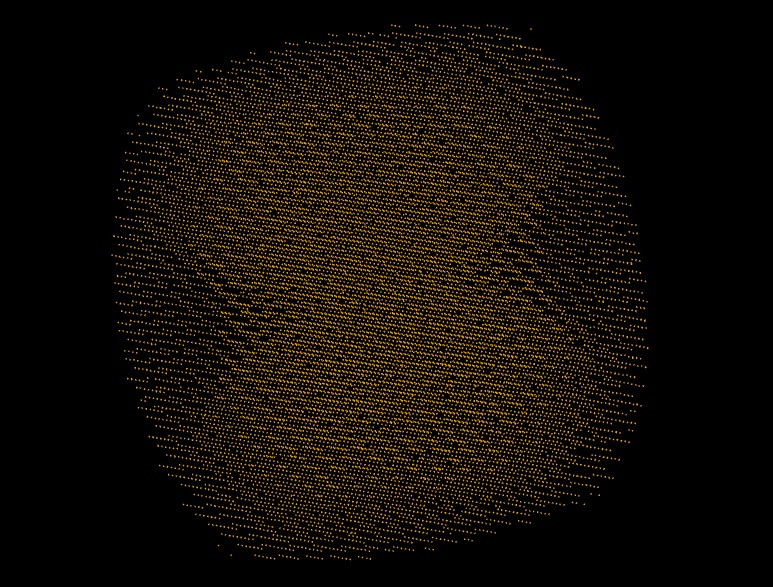

# Data Collection Strategies

A data collection strategy is, in the simplest sense, a set of settings used to acquire a data set. This can include the settings which impact the experimental geometry (wavelength, detector position), settings which affect how the data are recorded (number of images, rotation angles, image widths) and settings which balance the sample lifetime against the strength of the data (e.g. photon flux and exposure time). These settings can be split into two classes: those which dominate which data _can_ be measured and those settings which define how _well_ those reflections can be measured.

If you ignore symmetry, there is a limit to the fraction of intensities that can be measured, which is illustrated by [Ewald's construction](https://en.wikipedia.org/wiki/Ewald%27s_sphere) (which is simply another perspective on Bragg's law). This may be best understood by _looking_ at reciprocal space e.g. with `dials.reciprocal_lattice_viewer`:

This shows reflections found on diffraction images mapped to reciprocal space, and it can be seen that the overall shape is roughly a barrel, with a couple of cones cut out along the rotation axis (the blind region). It is impossible to measure these reflections in the blind region without reorientating the crystal with respect to the rotation axis. There are however two major redeeming factors:

- symmetry will often map these reflections from the blind regions to copies elsewere which _are_ measured
- as all atoms contribute to all intensities, and we have prior knowledge, we do not need to measure every one

In addition many instruments for recording X-ray diffraction data have multi-axis goniometers, which allow you to reorientate your sample to allow collection of this blind region.

## Minimal Data Collection

In the early days of X-ray diffraction where photographic film was used to record the data (discussed more [here](./detection.md)) reducing the number of images recorded had a practical impact on how long the data collection and processing took, not least reducing the number of trips to the darkroom. The widespread availability of electronic area detectors (1990's) moving through fast CCD detectors (2000's) to pixel array detectors (2010's to now) have reduced the practical cost of recording a large number of images. The process of calculating a data collection strategy is however a useful exercise in understanding the experiment itself.

A minimal data collection strategy will be, at the least, an angular range through which to rotate the sample while collecting data, which should be close to complete taking into account the crystal symmetry and known orientation. Optionally the strategy could also reorientate the sample to reduce the total amount of data needed to get complete coverage. A more sophisticated strategy could include a calculation of the minimal rotation range for each image to reduce overlapping reflections and some modelling of the background and strength of diffraction to offer some advice on relative exposure times. If the detector has some inherent noise (e.g. read out noise) then there can be a benefit in recording fewer, stronger data. If the detector has no read-out noise (e.g. photon counting pixel array detectors) then there is very little cost in recording a larger number of weaker observations.

## General Collection Strategies

In most cases the intention is to record a complete, well measured, data set within the constraints provided by the sample (e.g. lifetime) and instrumentation. With modern equipment the sample lifetime is the dominant limiting factor: simply the number of photons which can pass through the sample before an unacceptable amount of damage occurs. Within that constraint there is a direct trade-off: record few strong observations or a larger number of weaker observations. Within reason there is actually very little to call between these, however few observations constrains later choices in terms of reducing the extent of the data set. That said, very large numbers of very weak observations (say 10 full rotations of data) may bring a significant computational cost, and such data can be cumbersome to work with even if strictly speaking such a strategy is not wrong. Therefore we are again faced with a balance to strike. If the available detector is a photon counting pixel array detector (e.g. Eiger, Pilatus) then the following are easy recommendations to make:

- find a set of flux parameters such that a full rotation can be collected without substantial damage being observed
- collect data from multiple samples
- record no less than a full rotation: in the event of measuring more than a full rotation consider reorientation of the sample if equipment allows
- to find sensible parameters, start weak and ramp up the transmission

A wider discussion of this can be found [here](https://doi.org/10.1107/S2059798319003528).
