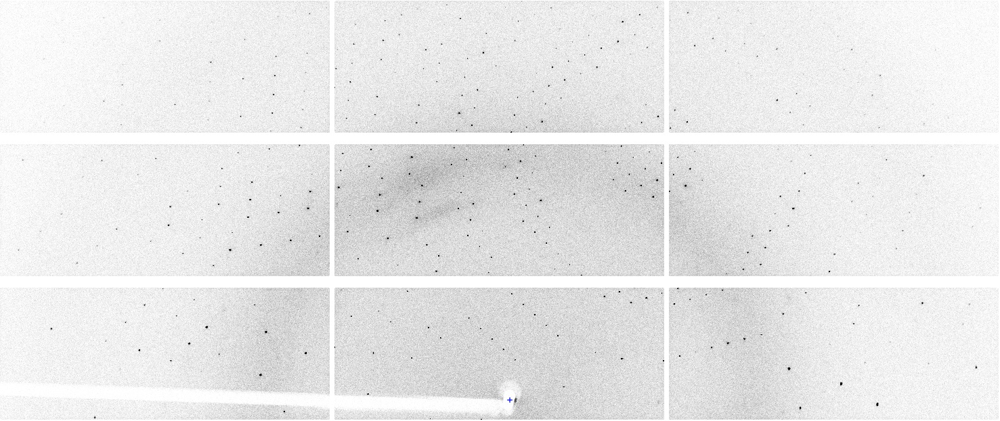
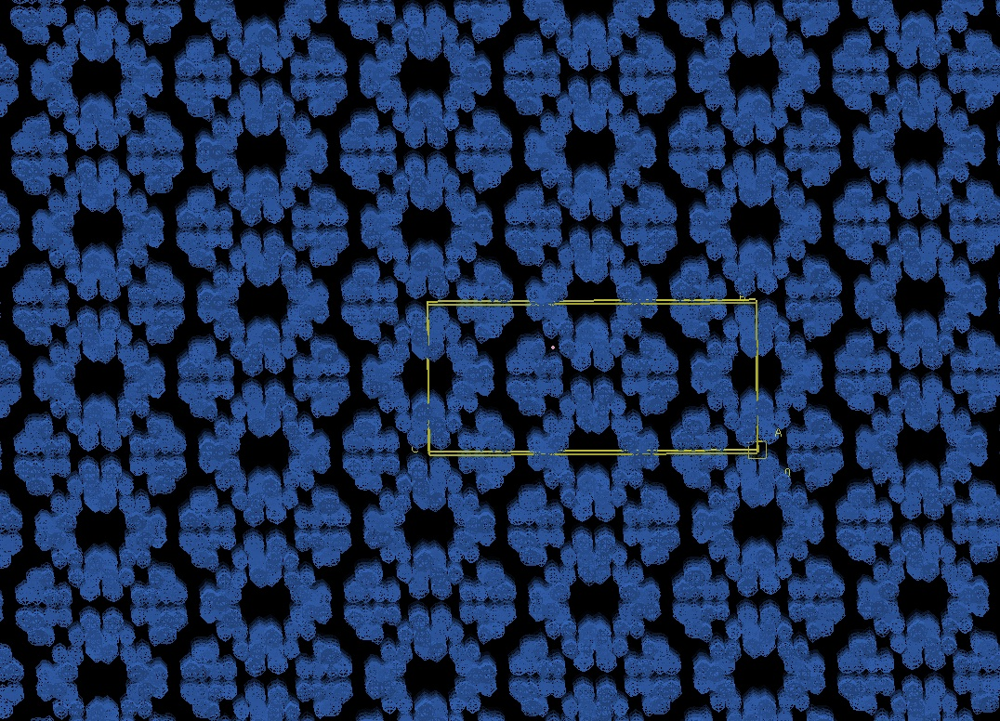

# Elements of X-ray Diffraction

## Basic Diffraction

X-ray diffraction is the phenomenon resulting from scattering of photons by atoms where the positions of the atoms has translational symmetry. The correlation of atomic positions gives rise to constructive interference, which in turn gives rise to preferred directions for scattered photons. If these preferred directions are mapped on to a detector the result is positions on the detector where more photons are found - spots - and (ideally blank) regions between them - background:

The positions of the spots depends on the geometry of the experimental set up and the unit cell of the crystal. The _intensity_ of the spots is dependent on the intensity of the beam, the number of unit cells illuminated by the beam, any effects from sample absorption and - of greatest interest - the arrangement of atoms within the unit cell. In practice, it is the electrons which scatter (since the scattering cross section is ~ 2000x that of protons) so we are actually measuring the positions of electrons within the unit cell, which could look something like:

These are data taken from a very well ordered small molecule. The intensity measurement itself is related to the electron density within the unit cell as the squared modulus of the Fourier transform of the density: low angle reflections depend on the bulk arrangement of electrons and higher angle scattering results from finer detail. These give rise to a number of important facts:

- the experimental geometry is critical for correctly interpreting the diffraction data
- all atoms contribute to all intensities
- atom identification is inferred from the electron densities (in the absence of additional information)

The extent to which you can measure high resolution data depends largely on the overall internal order of the crystal. A very well ordered crystal will have a very high degree of correlation across multiple unit cells of atomic positions, thus ensuring that the construcive interference is measurable. In a less well ordered crystal this correlation can break down, reducing the capability for measuring the fine detail. There is a critical point where the number of data measured match the number of free parameters required to model that data - 0.84Å. If data at this resolution or higher are not observed then additional information will be needed to ensure that the refinement is well determined. Fortunately we have access to a vast amount of external information, particularly in structural biology. The fact that proteins are made from amino acids, which are very well understood and (largely) have very well characterised geometry means that we can balance the data to parameter ratio by including more _a priori_ information about the atomic positions.

## Symmetry

Anything crystalline _must_ by definition have symmetry: at the very least there will be translational symmetry between unit cells. Most crystals have some additional symmetry e.g. some rotational symmetry which may be used to map the atomic positions onto themselves. This rotational symmetry within the crystal is then observed within the diffracted intensities. In addition, this symmetry has implications for the shape of the unit cell: if there is four-fold rotation symmetry about a certain axis, then that axis must be perpendicular to a square face of the unit cell and all angles in the unit cell must be 90°. The reverse is however not necessarily true: a square face unit cell does not require four-fold symmetry though it is likely that there is.

The practical result of this symmetry is that there are multiple copies of the same diffraction intensity, related by the same rotational symmetry operations as the atomic positions. This therefore means we can afford to record fewer individual measurements for a given volume of unit cell, or we can improve the measurements by measuring and comparing multiple copies. As will be discussed [later](./strategy.md) this duplication is in fact critical for properly interpreting the data and correctly assessing the data quality. Of course there is no such thing as a free lunch: though the symmetry reduces the number of data required for a given volume of unit cell, it will increase the volume of the unit cell by a corresponding amount, which ultimately gives rise to the resolution criterion above. It does however modify the geometrical considerations of performing the experiment.

## Geometry

Words.