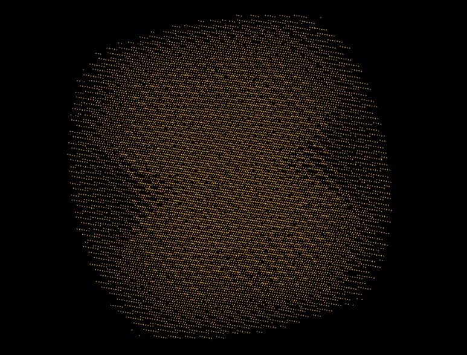

# Data Collection Strategies

A data collection strategy is, in the simplest sense, a set of settings used to acquire a data set. This can include the settings which impact the experimental geometry (wavelength, detector position), settings which affect how the data are recorded (number of images, rotation angles, image widths) and settings which balance the sample lifetime against the strength of the data (e.g. photon flux and exposure time). These settings can be split into two classes: those which dominate which data _can_ be measured and those settings which define how _well_ those reflections can be measured.

If you ignore symmetry, there is a limit to the fraction of intensities that can be measured, which is illustrated by [Ewald's construction](https://en.wikipedia.org/wiki/Ewald%27s_sphere) (which is simply another perspective on Bragg's law). This may be best understood by _looking_ at reciprocal space e.g. with `dials.reciprocal_lattice_viewer`:

This shows reflections found on diffraction images mapped to reciprocal space, and it can be seen that the overall shape is roughly a barrel, with a couple of cones cut out along the rotation axis (the blind region). It is impossible to measure these reflections in the blind region without reorientating the crystal with respect to the rotation axis. There are however two major redeeming factors:

- symmetry will often map these reflections from the blind regions to copies elsewere which _are_ measured
- as all atoms contribute to all intensities, and we have prior knowledge, we do not need to measure every one

In addition many instruments for recording X-ray diffraction data have multi-axis goniometers, which allow you to reorientate your sample to allow collection of this blind region.

## Minimal Data Collection

In the early days of X-ray diffraction where photographic film was used to record the data (discussed more [here](./detection.md)) reducing the number of images recorded had a practical impact on how long the data collection and processing took, not least reducing the number of trips to the darkroom. The widespread availability of electronic area detectors (1990's) moving through fast CCD detectors (2000's) to pixel array detectors (2010's to now) have reduced the practical cost of recording a large number of images.
